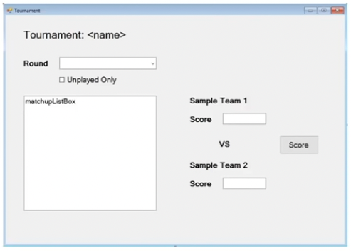
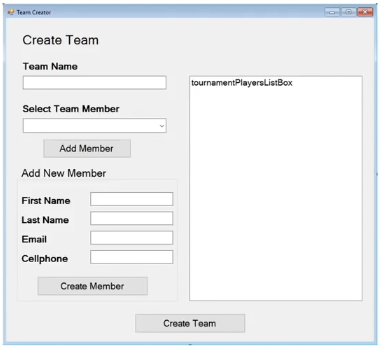
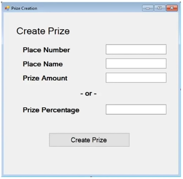
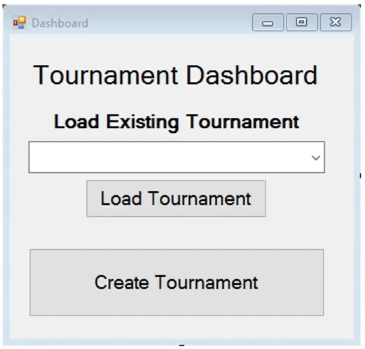

# tournament-tracker

:white_check_mark: June 13, 2022

### Lesson 1 : Initial Planning

- Always gather the requirement first, don’t do a rookie mistake of directly jumping into the code
- Always gather the full requirement
- Ask questions and gather more requirements
- Ask what type of front-end should the system have. Rookie mistake 2 is assuming. Never assume, 
ask questions.
- Ask and decide where will the data be stored?
- Ask what type of reporting is needed
- Are there varying level of access?

:white_check_mark: June 14, 2022

### Lesson 2 : Overview Planning

- If the number of players are not equally divisible, players are selected in random to skip the 
first round.
-  Each round should be fully completed before the start of the next round.
- The system should have a desktop system for now. Down the road, the system might turn into an app 
or a website. So, keep the long term vision in mind while designing the app. Here, code in such a 
way that we can easily disconnect the front end and later keep it in a new one. 
- The data will be stored in Microsoft SQL. But put in an option to store to a text file too.
- Prize should be an option. The prize amount should not exceed the total of the entry fee. Also, 
there should be an option to enter the prize amount percentage wise. However, all the entry fee may 
not be given away in prizes.
- A simple report specifying the outcome of the games per round and who won how much prize is 
needed. Also, email updates should be sent to the organizer and players.
- Anyone playing the tournament can fill up the score.
- Competitors are not allowed the system input, so they do everything via email.
- The system should email users about the upcoming schedule.
- The tournament tracker should be able to handle a team too. All the players should be treated 
equally. The team should be able to name their team.

**Now construct a big picture of the application:**
- Structure : Windows Form application and Class Library
- Data : SQL and/or Text File
- Users : One at a time on one application

**Key concepts:**
- Email
- SQL
- Custom events
- Error handling
- Interfaces
- Random ordering
- Texting (Possible add-on)

### Lesson 3 : Data Design

**Mapping the data:**

Team:
- TeamMembers (List<Person>)
- ReamName (string)

Person:
- FirstName (string)
- LastName (string)
- EmailAddress (string)
- CellphoneNumber (string)

Tournament:
- TournamentName (string)
- EntryFee (decimal)
- EnteredTeams (List<Team>)
- Prizes (List<Prize>)
- Rounds (List<List<Matchup>>)

Price
- PlaceNumber (int)
- PlaceName (string)
- PrizeAmount (decimal)
- PrizePercentage (double)

Matchup
- Entries (List<MatchupEntry>)
- Winner (Team)
- MatchupRound (int)

MatchupEntry
- TeamCompeting (Team)
- Score (double)
- ParentMatchup (Matchup)

:white_check_mark: June 15, 2022

### Lesson 4 : User Interface Design

Tournament viewer form


Create tournament form


Create team


Create Prize


Tournament dashboard


